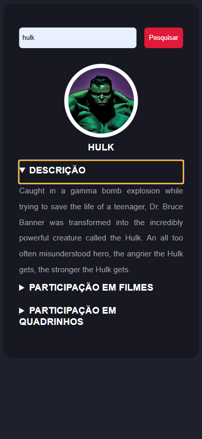

# Desafio-Marvel



> O objetivo deste desafio é criar uma pagina onde possamos digitar e pesquisar pelo nome do super-herói(na) e a busca nos retorne as seguintes informações:
  1. Nome
  2. Foto
  3. Descrição
  4. Participação em Filmes
  5. Participação em Quadrinhos

## 💻 Pré-requisitos

Antes de começar, verifique se você atendeu aos seguintes requisitos:

- Você instalou a versão mais recente de `<Angular / Node.js>`
- Você tem uma máquina `<Windows / Linux / Mac>`.
- Você leu `<https://developer.marvel.com/>` e `<https://developer.marvel.com/>` Guia de utilização da API MArvel.

## 🚀 Instalando <Desafio-Marvel>

Para instalar o <Desafio-Marvel>, siga estas etapas:

Windows:

Instalando o Angular:
```
<npm install -g @angular/cli>
```

Adicionando a dependencia do Angular Material.
```
ng add @angular/material
```

Baixar o Node.js
```
<https://nodejs.org/en/download>
```

## ☕ Usando <Desafio-Marvel>

Para usar <Desafio-Marvel>, siga estas etapas:

```
Clonando o repositorio no GitHub.
https://github.com/CaiqueCaah/Desafio-Marvel

Após a clonagem, acessar a pasta do projeto e então usar o comando a seguir.
ng serve

Acessar a pagina utilizando
<seu_localhost>/hero
```

Adicione comandos de execução e exemplos que você acha que os usuários acharão úteis. Fornece uma referência de opções para pontos de bônus!

## 📫 Contribuindo para <Desafio-Marvel>

Para contribuir com <Desafio-Marvel>, siga estas etapas:

1. Bifurque este repositório.
2. Crie um branch: `git checkout -b <nome_branch>`.
3. Faça suas alterações e confirme-as: `git commit -m '<mensagem_commit>'`
4. Envie para o branch original: `git push origin <nome_do_projeto> / <local>`
5. Crie a solicitação de pull.

Como alternativa, consulte a documentação do GitHub em [como criar uma solicitação pull](https://help.github.com/en/github/collaborating-with-issues-and-pull-requests/creating-a-pull-request).
